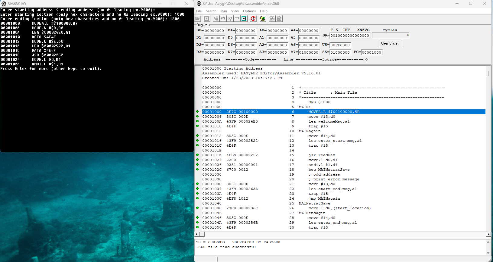
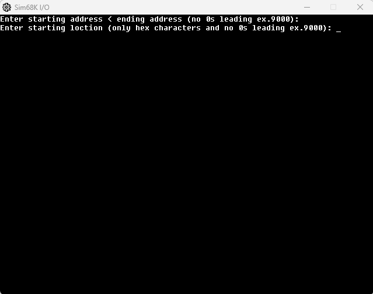
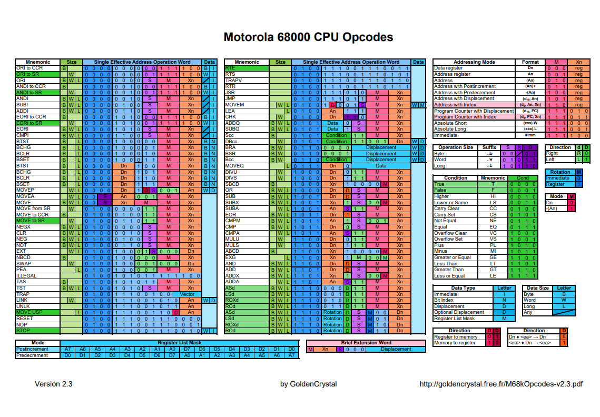
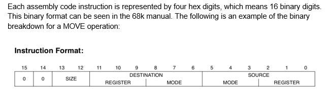

# Dissasembler
Converts a memory image of instructions and data back to 68000 assembly langauge and output the disassembled code to display. 

## Disassembler asks for starting location and ending location in hexadecimal format. 

## Dissasembler scans memory region and outputs the memory addresses of the instructions and the assembly language instructions contained in that region to display. 

## Reads each memory address, and goes through an algorithmic sequence to decipher correct opcode and affected memory locations.

This website was a big help https://mrjester.hapisan.com/04_MC68/

